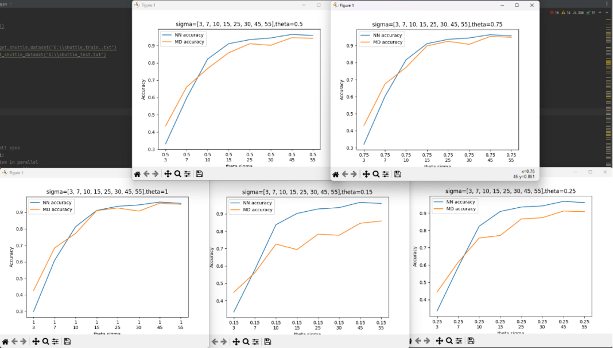

CKFD algorithm (KPCA Plus LDA) as described in the section 4.3 of the paper [KPCA Plus LDA: A Complete Kernel Fisher Discriminant Framework for Feature Extraction Recognition](http://www.cistib.org/gestpub/attachments/KPCA%20plus%20LDA%20a%20complete%20kernel%20fisher%20discriminant%20framework%20for%20feature%20extraction%20and%20recognition.pdf-a6f50f7697cd4b9dbbcc53af940b25eb.pdf)

The algorithm was tested on the olivetti dataset with average accuracy of 95% with a Nearest Neighbor classifier and 91.75% with a Mean Distance after 10-K fold validation using the Gaussian kernel.

Also tested on this [dataset](https://www.kaggle.com/datasets/birdy654/eeg-brainwave-dataset-feeling-emotions) for emotion detection based on EEG signals with mean accuracy of 96.25% with NN and 95.54% with MD classifers using the Gaussian kernel.

Linear,Sigmoid and Polynomial kernels are also implemented but the accuracy was lower for these datasets compared to the gaussian.

Scipy CDIST was used to speed up the pairwise distance calculation and numpy for the linear algebra , value decomposition and rank calculation. Multithreading was also used for running a grid search of the kernel parameters and the theta parameter for the classification on the decision level.

